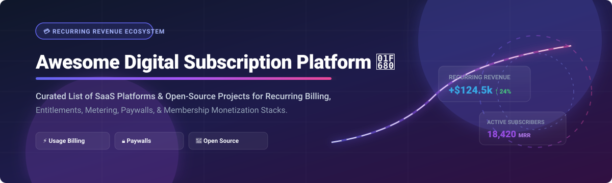

  

# 💳 Awesome Digital Subscription Platform 🚀

  
  
  
  
  
  

> **A curated list of top SaaS products, open-source billing engines, metered usage software, paywall frameworks, and recurring revenue tools for digital subscription platforms.**

---

## 📌 Overview & Ecosystem Focus

This repository tracks notable **SaaS platforms** and **open-source projects** for building modern **Digital Subscription Platforms**. Whether you are building a B2B SaaS startup, a publisher media outlet, or a creator community, these systems handle recurring subscription billing, meter usage-based pricing, manage paywalls, enforce entitlements, and automate subscriber dunning workflows.

*   **Commercial SaaS Leaders**: Features enterprise and mid-market billing suites including Chargebee, Zuora, Paddle, Recurly, Piano, Memberful, Memberstack, Outseta, Ghost (Pro), and Substack.
*   **Open-Source Infrastructure**: Open billing cores like Ghost, Hyperswitch, Listmonk, Lago, Invoice Ninja, Crater, Kill Bill, Solidus, and OpenMeter enable self-hosted, customizable recurring revenue stacks.

---

## 📚 Table of Contents

- [🏢 Hosted \& Commercial SaaS Platforms](#-hosted--commercial-saas-platforms)
- [💎 Open-Source GitHub Projects](#-open-source-github-projects)
- [🤝 How to Contribute](#-how-to-contribute)
- [💖 Support \& Sponsorship](#-support--sponsorship)
- [📈 Star History](#-star-history)
- [⚠️ Disclaimer](#%EF%B8%8F-disclaimer)

---

## 🏢 Hosted & Commercial SaaS Platforms

📊 **Market Size & Fragmentation**: The global digital subscription & billing management market size is estimated at **~$10.5 Billion in 2026** (projected to reach **$22.5+ Billion by 2030** at ~15% CAGR). The market is **moderately fragmented**: enterprise billing and revenue recognition are led by category giants (Zuora, Chargebee), while merchant-of-record platforms (Paddle), creator membership systems (Substack, Memberful), and usage-metering engines (Lago, OpenMeter) maintain strong dedicated niches rather than a single "winner-take-all" monopoly.

| Platform | Description / Primary Focus | Starting Tier Pricing | Free Tier / Free Trial Limits | Company Scale (Valuation / Revenue) |
| :--- | :--- | :--- | :--- | :--- |
| **[Chargebee](https://www.chargebee.com/)** | Enterprise & mid-market subscription billing, revenue recognition, invoicing, and retention. | **$599/mo** (Performance plan, billed annually for up to $100k MRR + 0.75% overage) | **Free Starter Plan** up to $250,000 cumulative revenue (0.75% overage fee after); or **14-day free trial** | **$3.5 Billion** Valuation (Series H) / ~$200M+ Annual Revenue |
| **[Zuora](https://www.zuora.com/)** | Enterprise subscription management, quote-to-cash, revenue recognition (ASC 606), and complex catalog billing. | **~$75,000/yr** (~$6,250/mo baseline custom enterprise contract) | **No free tier or public free trial**; request-based sandbox demo environment only | **$1.7 Billion** Acquisition Valuation (Silver Lake / GIC) / ~$420M ARR |
| **[Paddle](https://www.paddle.com/)** | Merchant of Record (MoR) platform handling global tax compliance, payments, and SaaS subscription billing. | **5% + $0.50** per transaction (pay-as-you-go, no monthly base fee) | **Free Sandbox environment** (pay $0 monthly fixed fee; fees charged per live transaction) | **$1.4 Billion** Valuation (Series D) / ~$91M Annual Revenue |
| **[Substack](https://substack.com/)** | Publishing platform for paid newsletters, podcasts, and member-supported content. | **10% revenue share** on paid subscriber income (+ Stripe payment fees) | **Free forever for creators** (unlimited free subscribers & free publications with $0 platform fee) | **$1.1 Billion** Valuation (Series C) / ~$50M ARR |
| **[Piano](https://piano.io/)** | Publisher-focused paywall, user journey personalization, customer data platform (CDP), and digital subscriptions. | **~$3,000 - $5,000/mo** (baseline custom enterprise contract) | **No free tier or public free trial**; custom product demo available upon request | **~$500 Million** Est. Valuation / ~$100M - $165M Annual Revenue |
| **[Recurly](https://recurly.com/)** | Mid-market subscription management, dunning/churn reduction, and recurring payments processing. | **$249/mo** (Starter plan, includes up to $40,000/mo volume + 0.9% revenue overage) | **90-day free trial** on Starter plan (no credit card required) | **~$300 Million** Est. Valuation / ~$56M Annual Revenue ($16B+ volume processed) |
| **[Memberful](https://memberful.com/)** | Membership access platform for creators, WordPress sites, podcasts, and digital communities. | **$49/mo** (Standard plan) + 4.9% transaction fee | **Free Starter Plan** ($0/mo + 10% transaction fee) or **unlimited test mode** before launch | **Acquired by Patreon** ($1.5B parent valuation) / ~$15M Est. Annual Revenue |
| **[Ghost (Pro)](https://ghost.org/)** | Managed hosting for open-source Ghost publishing platform, paid memberships, and newsletters. | **$15/mo** (Starter plan, billed annually) or $18/mo (billed monthly) | **14-day free trial** (core Ghost software is 100% free open-source self-hosted) | **~$11 Million** ARR (Non-profit foundation, transparent public financials) |
| **[Memberstack](https://www.memberstack.com/)** | Modular membership, user authentication, and Stripe payments for Webflow and custom web apps. | **$29/mo** ($25/mo billed annually, Basic plan up to 1,000 members + 4% transaction fee) | **Unlimited free trial in test mode** (no credit card required until project launch) | **~$30 Million** Est. Valuation (Y Combinator S20) / ~$5M ARR |
| **[Outseta](https://www.outseta.com/)** | All-in-one SaaS starter kit combining subscription billing, CRM, email marketing, and auth. | **$47/mo** ($37/mo billed annually, Founder plan) | **7-day free trial** with full platform feature access | **~$3 Million** ARR (Bootstrapped / Independent) |

---

## 💎 Open-Source GitHub Projects

Below are leading open-source repositories for self-hosted subscription billing, payment orchestration, newsletter publishing, and usage-based metering, sorted by GitHub stargazers count (descending):

1. 🌟 **[Ghost](https://github.com/TryGhost/Ghost)**   
   *Independent open-source publishing platform with native membership tiers, recurring payment support, and email newsletter publishing.*

2. ⚡ **[Hyperswitch](https://github.com/juspay/hyperswitch)**   
   *Open-source financial payment switch for global payments orchestration, smart routing, and subscription payment processing.*

3. 📬 **[Listmonk](https://github.com/knadh/listmonk)**   
   *High-performance self-hosted newsletter manager and mailing list manager frequently paired with publisher subscription systems.*

4. 🌊 **[Lago](https://github.com/getlago/lago)**   
   *Open-source metering and usage-based billing platform designed for developers—event ingestion, hybrid pricing plans, and invoicing.*

5. 🧾 **[Invoice Ninja](https://github.com/invoiceninja/invoiceninja)**   
   *Self-hosted open-source invoicing, recurring billing, and task tracking application for freelancers and small businesses.*

6. 🌋 **[Crater](https://github.com/crater-invoice/crater)**   
   *Open-source web and mobile invoicing software built with Laravel and Vue to track billing, payments, and recurring invoices.*

7. 🎯 **[Kill Bill](https://github.com/killbill/killbill)**   
   *The leading enterprise open-source subscription billing and payment platform with complex pricing models, plugin architecture, and dunning.*

8. 🛒 **[Solidus](https://github.com/solidusio/solidus)**   
   *Open-source e-commerce framework built on Ruby on Rails with extensible subscription order and recurring billing add-ons.*

9. 📊 **[OpenMeter](https://github.com/openmeterio/openmeter)**   
   *Cloud-native open-source usage metering platform for AI tools, API billing, and real-time usage-based monetization.*

---

## 🤝 How to Contribute

Contributions are warmly welcome! To submit new projects or update existing information:

1. 🍴 **Fork** this repository.
2. 📝 **Add or edit** entries in `README.md` following the established table / list format.
3. 🔍 Ensure descriptions remain **factual, concise, and linked to official repositories or websites**.
4. 📥 Submit a **Pull Request (PR)** with a clear title and summary of changes.

---

## 💖 Support & Sponsorship

If you find this curated list of digital subscription platforms useful for your projects or business:

*   ⭐ **Star** this repository on GitHub to show your support!
*   🍴 **Fork** and share it with fellow developers, SaaS founders, and creators.
*   ☕ **Sponsor / Buy a Coffee**: If you'd like to support ongoing maintenance and research, consider sponsoring via the [GitHub Sponsor Dashboard](https://github.com/sponsors/ishandutta2007).

Thank you for supporting open-source software and developer resources! 🙌

---

## 📈 Star History

---

## ⚠️ Disclaimer

- This repository is a **community-curated list** for informational and educational purposes. Inclusion does not constitute an endorsement.
- Subscription engines and payment systems handle sensitive customer transactions and personal data. Always ensure your deployment complies with PCI-DSS scope reduction, local tax/VAT regulations, privacy laws (GDPR/CCPA), and consumer billing transparency mandates.
- For curated awesome lists across all domains, check out [Awesome Awesome Awesome](https://github.com/ishandutta2007/Awesome-Awesome-Awesome).
